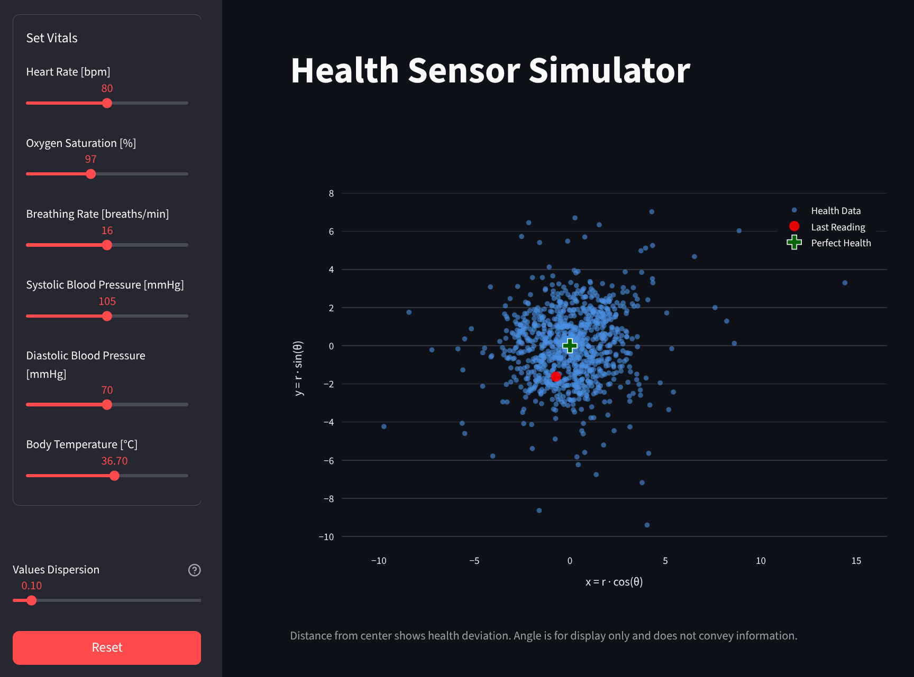
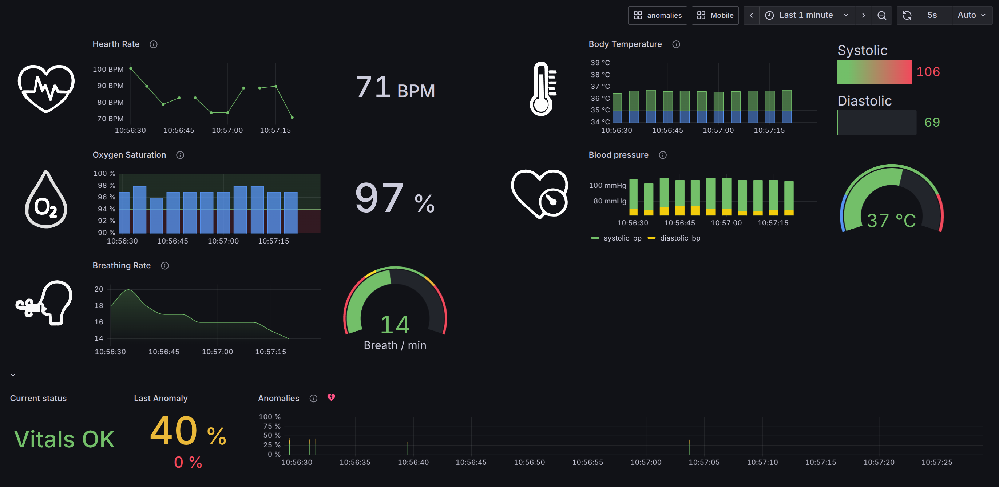
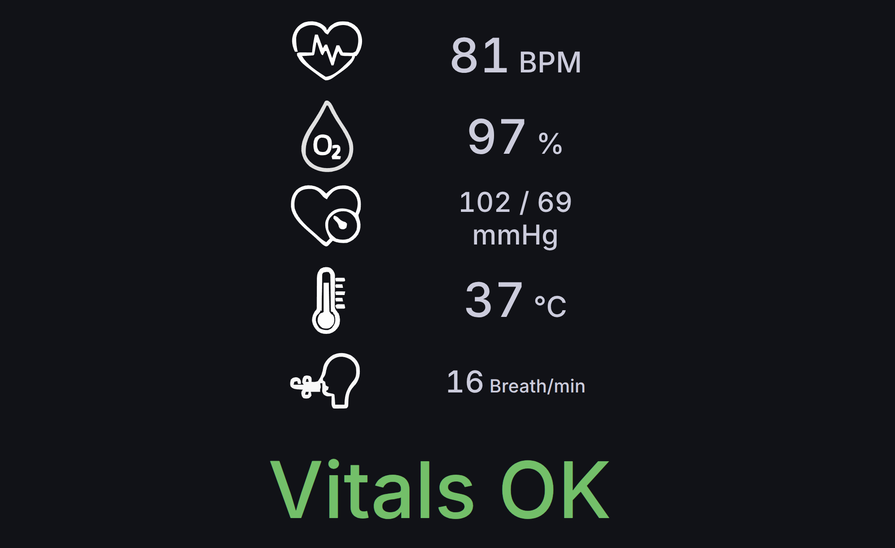

# Health Anomaly Detector Stack

**Health Anomaly Detector Stack** is a simulated end-to-end health monitoring system. It reproduces how a wearable device can track vital signs, detect anomalies with a machine learning model, and display both real-time and historical insights through intuitive dashboards.

## Architecture

### Architecture Overview
The Health Anomaly Detector Stack is designed as a complete pipeline that simulates data collection, anomaly detection, storage, and visualization. It combines data simulation with real-time monitoring and historical analysis, closely mimicking how a modern wearable system would operate.


At the core of the stack is the [Health Sensor Simulator](https://github.com/marcoom/health-sensor-simulator), which generates synthetic vital signs such as heart rate, blood pressure, and temperature. Unlike systems that rely on static thresholds, the simulator uses an Extended Isolation Forest (EIF)—a machine learning algorithm widely used in anomaly detection—to learn from each user’s data and raise alerts when unusual patterns occur. Parameters can be adjusted at any time through a simple Streamlit web interface.

The stack also includes a Grafana front end that mirrors the experience of a wearable companion app. Users can explore live data streams, investigate historical trends stored in a time-series database, and view alerts through two dashboards: a detailed view for analysis and a clean, real-time display for quick checks.

Data collection and alerting are managed by a Telegraf agent, which periodically queries the simulator for new vitals and instantly records anomalies via POST messages. All data is stored in InfluxDB with precise timestamps, ensuring reliable real-time monitoring and retrospective analysis.

### Key Components

The stack consists of five main components that work together to collect, process, store, and visualize health vitals data:

- **[Health Sensor Simulator](https://github.com/marcoom/health-sensor-simulator/)** - Simulates wearable devices generating vital signs data and sends alert when an anomaly is detected
- **Telegraf** - Data collection agent that polls vitals and forwards data to InfluxDB
- **InfluxDB 3** - Time-series database for storing health metrics
- **Grafana** - Visualization platform with custom health dashboards
- **InfluxDB3 Explorer** - Database browser for easy data exploration

### Features

- 🫀 **Real-time Health Monitoring** - Continuous collection of vital signs (heart rate, blood pressure, temperature, etc.)
- 🚨 **Anomaly Detection** - Built-in anomaly detection with configurable thresholds
- 📊 **Interactive Dashboards** - Custom Grafana dashboards with health-specific icons
- 🔍 **Data Exploration** - Web-based database browser for data analysis
- 🐳 **Containerized Deployment** - Complete stack runs with Docker Compose
- ⚙️ **Configurable** - Environment-based configuration for different deployment scenarios

### Demo


## Quick Start

### Prerequisites
- Docker and Docker Compose
- Git

### Initial Setup

1. **Clone the repository**
   ```bash
   git clone https://github.com/marcoom/health-anomaly-detector-stack
   cd health-anomaly-detector-stack
   ```

2. **Configure environment variables**
   First, copy the template file to create a new .env file:
   ```bash
   cp .env.template .env
   ```
   Then, edit the .env file to set the environment variables (leave the INFLUXDB_TOKEN variable as it is for now, it will be generated later).
   
3. **Start the InfluxDB service**
   ```bash
   docker compose up influxdb -d
   ```

4. **Generate InfluxDB token** (Required for first-time setup)
   ```bash
   docker compose exec influxdb influxdb3 create token --admin
   ```
   
5. **Update .env file**
   Copy the generated token and update the `INFLUXDB_TOKEN` variable in your `.env` file. Also ensure `INFLUXDB_RETENTION_PERIOD` is set to your preferred value (default: `30d`):
   ```bash
   INFLUXDB_TOKEN=your-generated-token-here
   INFLUXDB_RETENTION_PERIOD=30d
   ```

6. **Create InfluxDB database with retention period**
   Run the following command to create the database with the configured retention period:
   ```bash
   docker compose exec influxdb influxdb3 create database ${INFLUXDB_BUCKET} --retention-period ${INFLUXDB_RETENTION_PERIOD} --token ${INFLUXDB_TOKEN}
   ```
   *Note: If the database already exists, you can update its retention period using:*
   ```bash
   docker compose exec influxdb influxdb3 update database --database ${INFLUXDB_BUCKET} --retention-period ${INFLUXDB_RETENTION_PERIOD} --token ${INFLUXDB_TOKEN}
   ```

7. **Start the rest of the stack**
   ```bash
   docker compose up -d
   ```

## Access Points

Once the stack is running, access the following services:

| Service | URL | Description |
|---------|-----|-------------|
| **Health Simulator (UI)** | `http://localhost:8501` | Streamlit interface for the health sensor |
| **Grafana** | `http://localhost:3000` | Dashboards and visualization (admin/password) |
| **Health Simulator (API)** | `http://localhost:8000` | FastAPI endpoints for vitals data |
| **Interactive API Documentation** | `http://localhost:8000/docs` | Swagger UI for API testing and documentation |
| **InfluxDB** | `http://localhost:8181` | Time-series database |
| **InfluxDB Explorer** | `http://localhost:8888` | Database browser and query interface |

## Configuration

### Environment Variables

The stack is configured through environment variables defined in `.env`. Key configurations include:

```bash
# Health Sensor Simulator
STREAMLIT_PORT=8501
FASTAPI_PORT=8000
ALARM_ENDPOINT_URL=http://telegraf:8080/telegraf
DATA_GENERATION_INTERVAL_SECONDS=5
ANOMALY_DETECTION_METHOD=EIF  # Extended Isolation Forest
EIF_THRESHOLD=0.4
DISTANCE_THRESHOLD=3.8
LOG_LEVEL=INFO

# InfluxDB
INFLUXDB_PORT=8181
INFLUXDB_TOKEN=your-influxdb-token-here
INFLUXDB_BUCKET=health
INFLUXDB_ORG=health_org
INFLUXDB_RETENTION_PERIOD=30d
INFLUX_EXPLORER_PORT=8888

# Grafana
GRAFANA_PORT=3000
GRAFANA_ADMIN_USER=admin
GRAFANA_ADMIN_PASSWORD=password
GRAFANA_INI=./grafana/configs/grafana.ini
GRAFANA_DASHBOARDS_CONFIG=./grafana/configs/dashboards.yaml
GRAFANA_DATASOURCES_CONFIG=./grafana/configs/datasources.yaml
GRAFANA_ALERTING_CONFIG=./grafana/configs/alerting.yaml
GRAFANA_DASHBOARDS_DIR=./grafana/dashboards
GRAFANA_CUSTOM_ICONS_DIR=./grafana/icons

# Telegraf
TELEGRAF_COLLECTION_INTERVAL=5s
TELEGRAF_CONFIG_PATH=./telegraf/telegraf.conf
```

## Usage

### Vitals generation
Open your browser and navigate to `http://<your-ip>:<STREAMLIT_PORT>` (default: http://localhost:8501). From this interface you can control how synthetic vitals are generated:
- **Sliders per vital** adjust the mean value of each measurement.
- A **dispersion slider** controls the randomness around those means (set it to 0 for fixed values).
- By default, a new data point is generated every 5 seconds.

On the right-hand side, a scatterplot provides a live visualization. The most recent reading is shown in red, plotted against the rest of the dataset. The cluster’s center is marked as Perfect Health, helping you visually gauge how far a new point deviates from the norm. The chart updates with each new reading.

If the latest data point is flagged as an anomaly, a warning message appears below the graph, displaying the calculated anomaly probability.



### Monitoring Health Data
Open Grafana by navigating to `http://<your-ip>:<GRAFANA_PORT>` (default: http://localhost:3000) and log in with your credentials (GRAFANA_ADMIN_USER and GRAFANA_ADMIN_PASSWORD, default: *admin / password*).

After login, you will be redirected to the **Historical Dashboard**, which displays both real-time and past measurements generated by the Streamlit UI. You can adjust the visible time range using the date picker in the upper-right corner.



Indicators are color-coded based on predefined “normal” ranges for each vital (these ranges come from medical references, not from the anomaly detector).

- Values within range are shown in **green** or **white** (depending on the panel).
- Values outside range appear in **yellow** or **red**, depending on how far they deviate.

At the bottom of the dashboard, three panels focus specifically on **anomalies** detected by the machine learning model (Extended Isolation Forest). Unlike the predefined ranges above, these anomalies are learned from the user’s own historical data, meaning they adapt to each individual’s normal patterns rather than relying on fixed thresholds:

1. **Current Status** — Shows the latest measurement. It reports Vitals OK if no anomalies are detected, or the anomaly probability percentage (0–100%). A score of 100% means full certainty of an anomaly.

2. **Last Anomaly Probability** — Displays the probability of the most recent anomaly within the selected time range, or No anomalies if none occurred.

3. **Anomaly Timeline** — Visualizes anomalies detected in the selected range. Each anomaly is represented by a vertical bar whose height corresponds to the anomaly probability (0–100), and the color indicates severity (green, yellow, orange, red).

You can also switch to the **Mobile Dashboard** via the “Mobile” link in the top-right menu.

The Mobile Dashboard provides a simplified view optimized for small screens, showing only the latest readings and real-time anomaly detections without historical data or visual clutter. To return, click on the “Historical” link at the top-right of the screen.



### Common Commands

```bash
# View logs for specific services
docker compose logs -f health-sensor-simulator
docker compose logs -f telegraf
docker compose logs -f influxdb
docker compose logs -f grafana

# Restart specific service
docker compose restart <service-name>

# Stop the entire stack
docker compose down

# Remove all data (including InfluxDB volumes)
docker compose down -v

# Delete InfluxDB volume
docker volume rm health-anomaly-detector-stack_influxdb_data
```

## Development

### Project Structure

```
health-anomaly-detector-stack/
├── compose.yml                # Docker Compose configuration
├── .env.template              # Environment variables template
├── .env                       # Actual environment file
├── CONTRIBUTING.rst           # Contribution guidelines  
├── LICENSE.txt                # License file
├── SECURITY.md                # Security guidelines
├── README.md                  # Project documentation
├── media/                     # Documentation assets
├── grafana/
│   ├── configs/               # Configuration files
│   │   ├── alerting.yaml      # Alert rules provisioning
│   │   ├── dashboards.yaml    # Dashboard provisioning
│   │   ├── datasources.yaml   # Data source provisioning
│   │   └── grafana.ini        # Main Grafana config
│   ├── dashboards/            # Dashboard definitions
│   │   ├── historical.json
│   │   └── mobile.json
│   └── icons/                 # Custom health-related icons
└── telegraf/
    ├── telegraf.conf          # Main configuration
    └── sample-telegraf.conf   # Sample configuration
```

## Troubleshooting

### Common Issues

1. **InfluxDB Connection Errors**: Ensure the token is properly generated and configured in `.env`
2. **Port Conflicts**: Check that configured ports are not in use by other services
3. **Volume Permissions**: Ensure Docker has proper permissions for volume mounts

## License
This project is licensed under the **MIT License** — you are free to use, modify, and distribute it, with attribution. See the [LICENSE](LICENSE) file for details.

## Related Projects

- **[Health Sensor Simulator](https://github.com/marcoom/health-sensor-simulator/)** - The core health data generation component

---

For issues, questions, or contributions, please refer to the project's issue tracker.